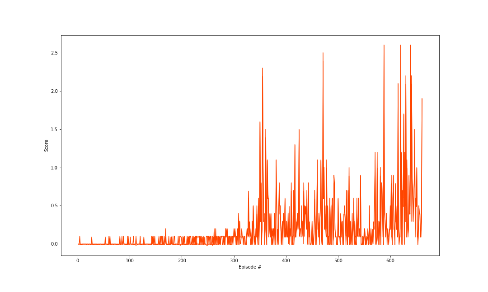
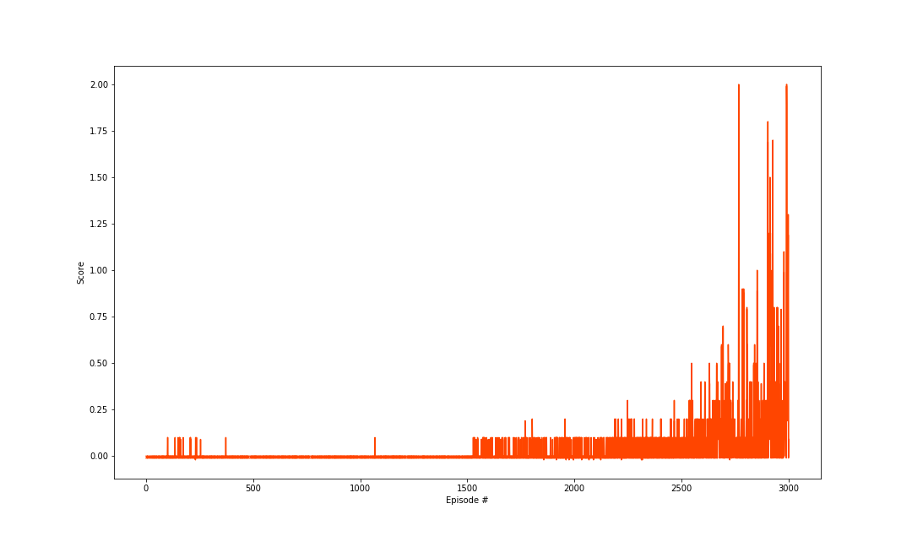

## Report on MADDPG of Tennis Game

### Model Architecture

- Actor    
    - Hidden: (state_size, 256)  - ReLU
    - Hidden: (256, 128)    - ReLU
    - Output: (128, action_size)      - TanH

- Critic
    - Hidden: (state_size, 256)              - ReLU
    - Hidden: (256 + action_size, 128)  - ReLU
    - Output: (128, 1)                  - Linear

### Hyperparameters
- Learning Rate: 1e-3 (Actor)
- Learning Rate: 1e-4 (Critic)
- Batch Size: 128
- Replay Buffer: 1e6
- Gamma: 0.99
- Tau: 1e-1
- Ornstein-Uhlenbeck noise parameters (0.15 theta and 0.2 sigma.)

## Results

There are several phenomenons showed up in this experiment worth to talked about.

### 1. Share or NOT!

First, I use a completely seperate actors, critics and buffers for each agent. Also, I try to implement the Centralized action-value function that takes as input the actions of all agents, and in addition to all the observation. Unfortunately, it did not perform good within 3000 episodes, which cannot converge to the benchmark.

Therefore, I try the following condition: 
* Both agents use the same actor and critic.
* Both agents use the same actor but different critic.
* Both agents use the same critic but different actor.

And finally I find the third idea can be implement quite well, which overwhelm the benchmark trained after around 400 episodes. 

### 2. The Soft-update Parameter

I set $\tau$ as 1e-4 fisrtly. It did improve agent's performance, but it cannot achieve the benchmark within 3000 episodes.Then I set it as 1e-2 and 1e-3, and here are the total reward during training process.

The result is that when I set the $\tau$ to 1e-2, it converge to benchmark quite quickly, which took it 660 episode to achieve.

## Future Work

I would like to implement A2C and PPO in the games in order to figure out which one has the best performance.
